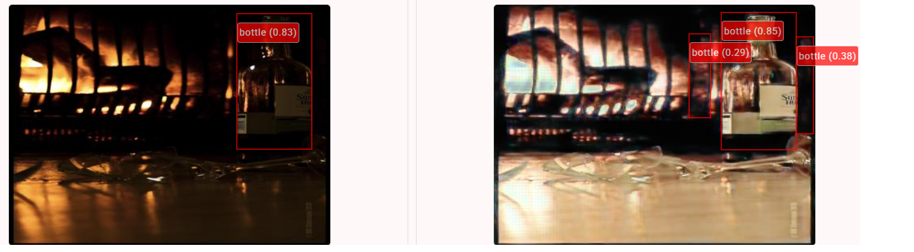
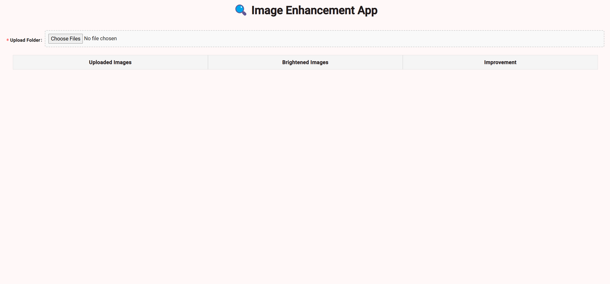
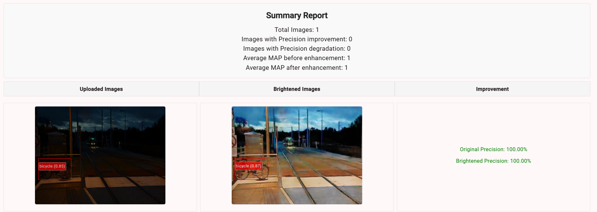

# 💊 Image Enhancement App for Medical Use

This project focuses on enhancing low-light medical images - specifically, images of pills - to improve the performance of downstream computer vision tasks like object detection of various object detection models.

## 🧠 Motivation

In medical industry, with more CV models being used in various lighting conditions, images captured in low-light environments (e.g. dimly lit homes/ storage units) often suffer from poor visibility.

This can reduce the precision and confidence levels of object detection models.

## 🎯 Goals

To address this, we aim to build image enhancement model optimized for medical scenarios to

- improve the visual quality of pill images
- Enhance object detection precision and confidence
- Enable better performance in real-world low-light environments

## ✨ Overview

Pipeline is built to send uploaded image to object detection model before enhancement and after enhancement. Thereafter, we make comparison to the Ground Truth to obtain the precision for image before enhancement and after enhancement.



# 🚀 Getting Started

## 1. Clone the repository

Create a new folder and run the following command to clone the project:

`git clone https://github.com/wj331/imageEnhancementProject.git`

## 2. Install Dependencies

Install all required modules and dependencies:

`pip install -r requirements.txt`

## 3. Start the Interface ▶️

### 3.1 Frontend server

First we go into the front end folder:

`cd image-enhancement-app`

Next, we run the following for a dev server:

`ng serve`

Lastly, navigate to `http://localhost:4200/` for the frontend page.



### 3.2 Backend server

Similarly, we go into the main code folder:

`cd image-enhancement-app`

Next, we do the following to boot up the backend:

`python -m backend.app`

### 3.3 Configure Model

We can go into `app.py` to enhance with different models:

```
    #Enhance the image using CLAHE
    enhanced_img = enhance_image(img)

    #Enhance the image using Zero-DCE
    enhanced_img = enhance_image_zerodce(img)
    
    #Enhance the image using RetinexFormer
    enhanced_img = enhance_image_retinexformer(img)
```
> 💡 **Note:** If you're using a model with pretrained weight, please change the path to refer to the correct pretrained weights in `retinexformerEnhancement.py` and `zerodceEnhancement.py`


## 4. Run the application: 💫

Select a folder of dimly lit files and watch our model enhance your image to increase confidence!



# Next steps:

1. Fine-tuning with custom datasets (especially with pill datasets) especially on existing pretrained weights such as SDSD_indoor
2. Explore other models such as RetiDiff / GLARE

## Further help

To get more help on the Angular CLI use `ng help` or go check out the [Angular CLI Overview and Command Reference](https://angular.dev/tools/cli) page.
